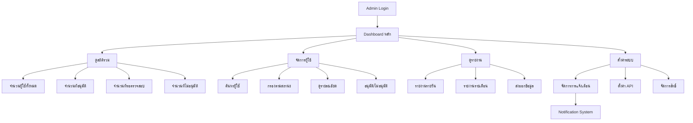

```mermaid
graph TD
    A[Admin Login] --> B[Dashboard หลัก]
    
    B --> C[ดูสถิติรวม]
    B --> D[จัดการผู้ใช้]
    B --> E[ดูรายงาน]
    B --> F[ตั้งค่าระบบ]
    
    C --> G[จำนวนผู้ใช้ทั้งหมด]
    C --> H[จำนวนที่อนุมัติ]
    C --> I[จำนวนที่รอตรวจสอบ]
    C --> J[จำนวนที่ไม่อนุมัติ]
    
    D --> K[ค้นหาผู้ใช้]
    D --> L[กรองตามสถานะ]
    D --> M[ดูรายละเอียด]
    D --> N[อนุมัติ/ไม่อนุมัติ]
    
    E --> O[รายงานรายวัน]
    E --> P[รายงานรายเดือน]
    E --> Q[ส่งออกข้อมูล]
    
    F --> R[จัดการการแจ้งเตือน]
    F --> S[ตั้งค่า API]
    F --> T[จัดการสิทธิ์]
    R --> U[Notification System]
```